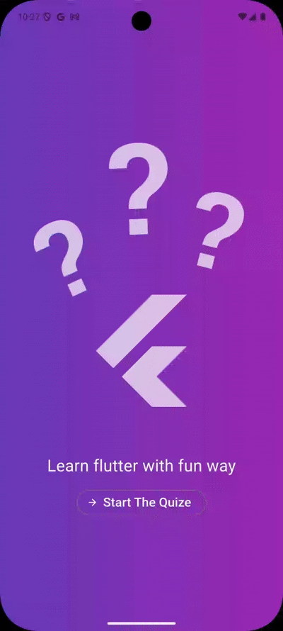

  

<!-- HEADER CARD -->

 

  <b>Flutter Developer</b> · <b>4th Year Computer Science Student</b>  
  📍 Egypt

---

## 🧑‍💻 About Me 

- Flutter developer with **1+ year of hands-on experience building real apps**
- 4th year Computer Science student
- Interested in modern UI / UX & clean design
- Learn by building real projects
- 🎯 Goal: build real-world Flutter applications and scalable products

---

## 🛠 Skills & Tech Stack

  

  

---

## 🌐 Connect With Me

  
  
  

---

## 🎬 App Demos

  <table>
    <thead>
      <tr>
        <th>Favorite Places App</th><th>News App</th><th>Quiz App</th>
      </tr>
    </thead>
    <tbody>
      <tr>
        <td></td>
        <td></td>
        <td></td>
      </tr>
    </tbody>
  </table>

<!-- 

  
  <b>Favorite Places App</b>

 -->

<!-- 

  
  <b>News App</b>

 -->

<!-- 

  
  <b>Quiz App</b>

 -->

---

## 📊 GitHub Stats

  
  

---

⭐ Thanks for visiting my profile!
